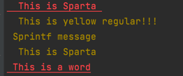

# colorify

`colorify` is a very simple implementation of a text stream formtatting library, usually out of a tty into stdout.

Its mostly a simple implemention and not have all the robust options as `fatih/color` ANSI colorized output package. 

## Install
go get github.com/mainak90/colorify

## Examples


```bash
    // Import the library into your code
    import "github.com/mainak90/colorify"
```

```go
    // Generate the color format as needed by starting an instance of colorify. And appending it into the fmt based wrapper interfaces.

    red := colorify.Colorify{Color: colorify.Red, Attr: colorify.Underline}
    yellow := colorify.Colorify{Color: colorify.Yellow, Attr: colorify.Regular}
    redPrint := red.New()
    yellowPrint := yellow.New()
    redPrint.Println("This", "is", "Sparta")
    yellowPrint.Println("This is yellow regular!!!")
    fmt.Println(yellowPrint.Sprintf("Sprintf message"))
    io.WriteString(os.Stdout, yellowPrint.Sprintln("This", "is", "Sparta"))
    redPrint.Printf("%s", "This", "is", "a", "word")
```

## Output


## Todo
1. GH Actions pipelines.
2. Tests.
3. More functions.

## License

The MIT License (MIT) - see [`LICENSE.md`](https://github.com/mainak90/colorify/blob/main/LICENSE.md) for more details