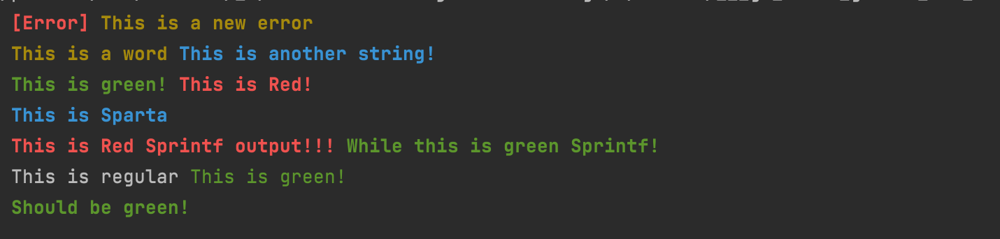

# colorify [](https://github.com/mainak90/colorify/actions) [](https://pkg.go.dev/github.com/mainak90/colorify)

`colorify` is a very simple implementation of a text stream formtatting library, usually out of a tty into stdout.

Its mostly a simple implemention and not have all the robust options as `fatih/color` ANSI colorized output package. 
It gets the job done and I use it frequently to generate colorized output myself, especially for colorizing CLI outputs.

## Install
```bash
    go get github.com/mainak90/colorify
```

## Examples
```bash
    // Import the library into your code
    import "github.com/mainak90/colorify"
```

```go
    // Initialite a colorify struct. Structs can be initialized either with only string attributes(bold/italics/reverse)
	// Or also with color values set.
	// Example --> Struct with no color set. 
	noColStruct := colorify.Colorify{Attr: colorify.Underline}
    // Example --> Struct with color preset.
	withColStruct := colorify.Colorify{Color: colorify.Green, Attr: colorify.Bold}
	// Supported attributes --> 
	1. `colorify.Regular`: Regular text format.
	2. `colorify.Italics`: Italicized text format.
	3. `colorify.Transparent`: Transparent text format.
	4. 	`colorify.Reverse`: Background reversed text format.
    // Invoking the print functions after this is just as easy as calling the appropriate ones with particular arguments.
	// Please note that the library has support column based coloring scheme, which means you can have as many colors in 
	// one single line as you want.
	io.WriteString(os.Stdout, noColStruct.Sprintln("This is regular", colorify.Green, "This is green!"))
	noColStruct.Println(colorify.Red, "[Error]", colorify.Yellow, "This is a new error")
    io.WriteString(os.Stdout, col.Sprintln("\n", colorify.Blue, "This", "is", "Sparta"))
	// Example with color initialized in struct.
    withColStruct.Println("Should be green and bold!")
```

For more examples checkout the `examples/` directory.

## Output


## Todo
1. <strike>GH Actions pipelines</strike> -> `Done`
2. Tests.
3. More functions.
4. Fix logged issues.

## License
The MIT License (MIT) - see [`LICENSE.md`](https://github.com/mainak90/colorify/blob/main/LICENSE.md) for more details